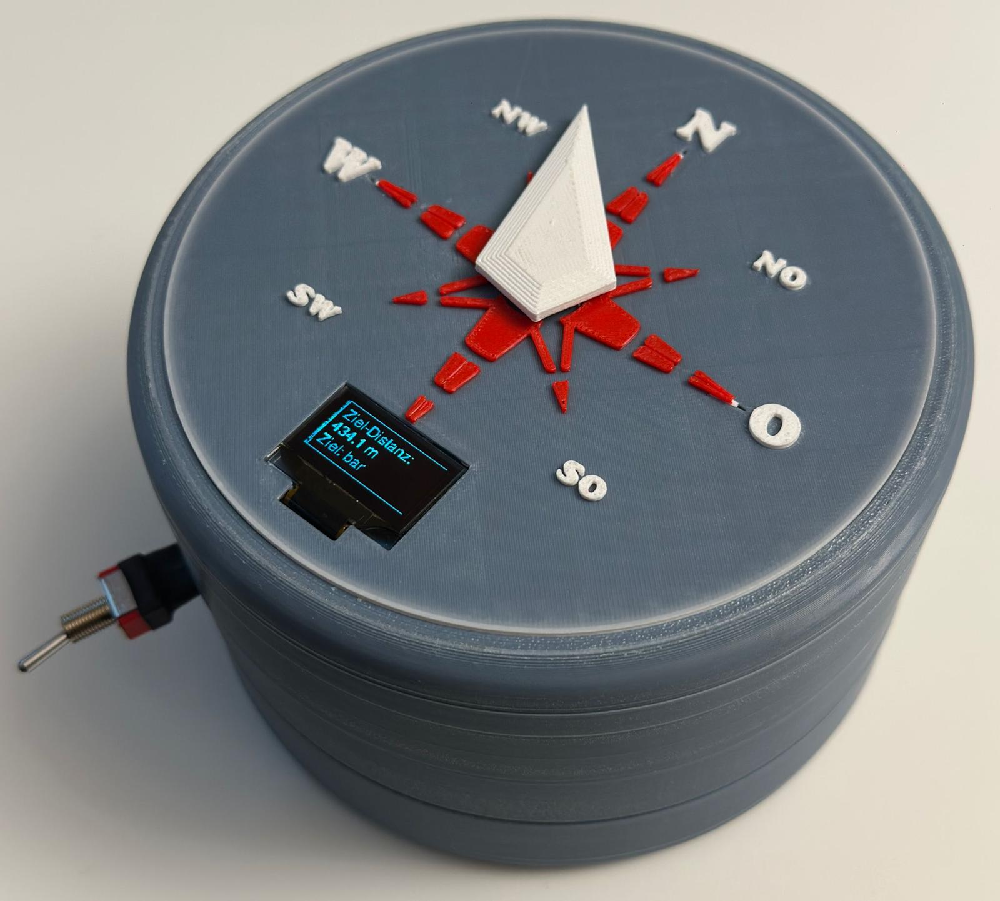

# BarFinder

BarFinder ist ein physisches Gadget, das wie ein Kompass funktioniert.
Allerdings zeigt die Nadel nicht nach Norden, sondern zur nächstgelegenen Bar.

Dazu kombinieren wir mehrere Hardware Komponente, steuern diese mit unserem Code und verbauen das ganze in ein selbst konstruiertes und 3D gedrucktes Gehäuse.

##  Funktionsweise

- GPS bestimmt den aktuellen Standort  
- Über OpenStreetMap wird die nächste Bar ermittelt  
- Ein Magnetometer misst die Ausrichtung  
- Ein Stepper-Motor dreht den Zeiger zur Bar  
- Ein OLED-Display zeigt die Distanz in Metern (Luftlinie)

## Hardware

- Raspberry Pi Zero WH  
- GPS-Modul  
- Magnetometer  
- Stepper-Motor + Treiber  
- OLED-Display  
- 3D-gedrucktes Gehäuse  
- externe Powerbank
